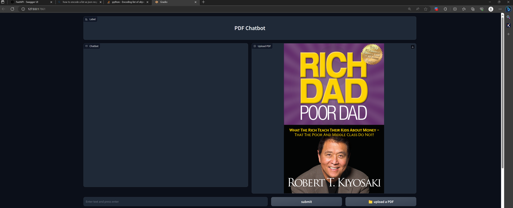

# **Gradio Webpage Chatbot**

Gradio Webpage Chatbot is a Python application that allows you to generate context and have a conversation with a chatbot based on web content. It uses Gradio for the user interface and leverages Langchain and Chroma for text and content retrieval.

## Prerequisites

Before running the application, make sure you have the following dependencies installed:

- Python 3.x
- Gradio
- Langchain
- Chroma
- PyMuPDF
- PIL (Pillow)
- requests

You will also need an OpenAI API key to enable chat capabilities.

## Installation

1. Clone this repository to your local machine:

```bash
git clone https://github.com/ideepankarsharma2003/URL_WEB_PAGE.git
cd gradio-webpage-chatbot
```

2. Install the required Python packages:

```bash
pip install -r requirements.txt
```

3. Set your OpenAI API key in the `keys.py` file.

## Usage

1. Run the Gradio application:

```bash
python gradio_webpage_chatbot.py
```

2. Access the application in your web browser by opening the provided URL.

3. Enter a query in the "URL WebPage Chatbot" section and specify the number of URLs you want to retrieve content from.

4. Click the "Generate context" button to generate context from the web content.

5. Enter your text in the "Enter your text here and press submit" text box.

6. Click the "submit" button to interact with the chatbot. The chat history and generated PDF will be displayed on the right side of the application.

## Functions

The `qa_gen_api_extract_all_passages` internally refers to:
- **Extract All Passages Endpoint**

The `extract_all_passages` endpoint is part of our proprietary API and is responsible for extracting paragraphs and URLs based on a provided query. It is designed to return relevant content from the web in response to user queries.

- `Endpoint Description``

- **URL:** `/extract_all_passages`
- **Method:** POST
- **Request Body:** JSON
  - `query` (string): The user's query for content extraction.
  - `num_urls` (integer): The number of URLs to search for content.
- **Response:** JSON
  - `paragraphs` (list of strings): Extracted paragraphs relevant to the query.
  - `urls` (list of strings): URLs that were used for content extraction.

- `Example Usage``

You can make a POST request to the `/extract_all_passages` endpoint with the following JSON request body:

```json
{
  "query": "Your query here",
  "num_urls": 5
}
```

The endpoint will respond with a JSON object containing the extracted paragraphs and URLs:
```json

{
  "paragraphs": ["Extracted paragraph 1", "Extracted paragraph 2", ...],
  "urls": ["URL 1", "URL 2", ...]
}
```


## alternative: 
Instead of using the api you can utilize the   `utils/cleaner.py` module:
```python
    extract_paragraphs(url, tries=0)
```
which will return a list of paragraphs from the given URL. Also notice `scrapperapi` is a proprietary variable which you need to drop or replace.


## Screenshots <br>

 <br>

 <br>


 <br>

 <br>

